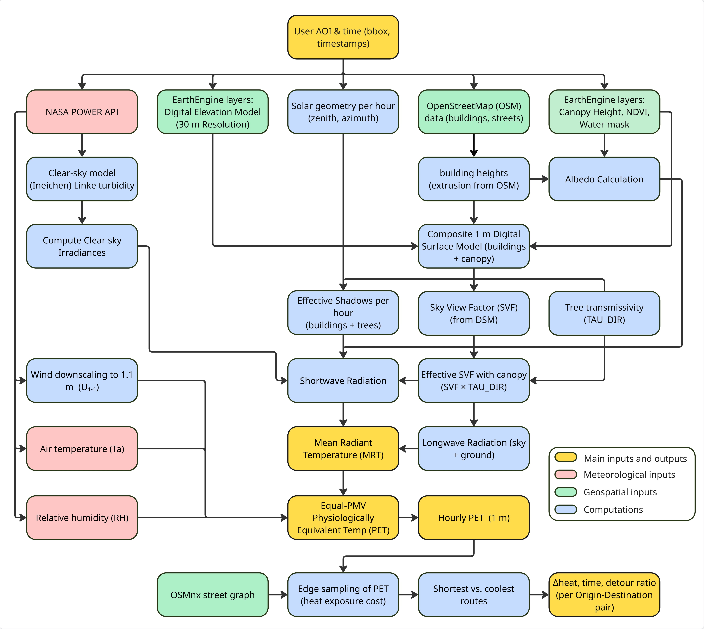
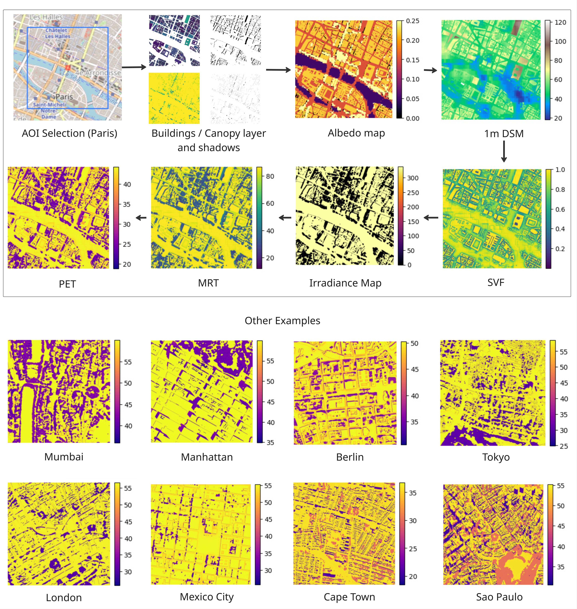
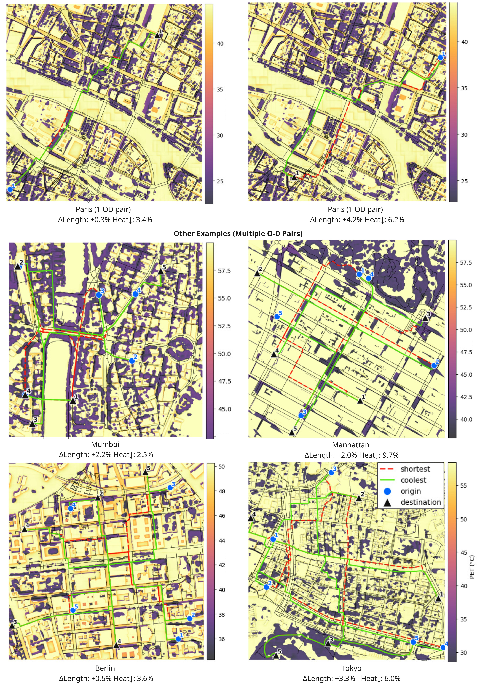

# Coolpaths

A pipeline to create Pysiologically Equivalent Temperature (PET) maps and to find cooler paths in the cities worldwide. It utilizes EarthEngine-based geospatia datasets, OSM,  Python libraries and NASA Power API for meteorological inputs.

  

  <a href="https://coolpaths.netlify.app/"><b>Coolpaths Website</b></a>

## Methodology
PET quantifies the combined effect of solar and thermal radiation on humans and is key to assessing outdoor comfort. The pipeline automatically extracts building footprints, infers building heights, and computes shadows and sky-view factors. It uses Google Earth Engine to obtain tree canopy layers and other open-access satellite data products to compute vegetation, impervious surfaces, and water bodies, which help generate surface albedo maps. Solar irradiance, Mean Radiant Temperature (MRT), and PET maps are then created using meteorological inputs retrieved from the NASA Power API. The generated maps are then fed into an OSM-based routing engine to identify shorter, cooler paths.

  

## PET generation process
Starting from a user-defined bounding box and date,  (a) a 1 m resolution DSM (digital surface model) is built by upsampling a 30m DEM raster, incorporating buildings with heights from OSM, and a 1 m resolution canopy layer. The resulting DSM is used to create the Sky View Factor (SVF) map. Then (b) vegetation, impervious, building, water masks are derieved to develop a surface-albedo map; further, (c)  hourly building and tree shadows and clear-sky shortwave components, daily aerosols and hourly irradiance are computed using NASA POWER API, (d) per-timestamp irradiance fields are calculated which are then combine with longwave terms and SVF to produce MRT rasters, (e) MRT and meteorology (Ta, RH, wind) are converted into PET via an equal-PMV formula. All outputs are written as GeoTIFFs (1 m grid), allowing for direct comparison across sites and time. Finally, (f) PET maps are used for OSM-based routing analyses to find cooler paths.

  

## Coolpaths routing
For each study bounding box, we first attempt to construct a pedestrian graph with the network type set to “walk”. If the walk graph is too sparse (fewer than ~300 edges), we fall back to a “drive-proxy” graph that combines type set to “drive” with “walk”. We assign a thermal travel cost to each edge by sampling the PET along its geometry at 1 m spacing. Origin-destination (OD) pairs are drawn uniformly at random from graph nodes with the constraint that the shortest-by-distance path between them is at least 800 m, ensuring trips long enough for meaningful detours (Figure 3). For each OD, we compute two routes. The baseline is the classic shortest path by geometric length; we record its length L_0 and its cumulative heat H_0, which is given by the sum of edge heat costs along the path. The alternative is the coolest feasible route, which minimizes cumulative heat subject to a distance budget L (less than equal to) (1 + delta)L_0, where a detour cap of delta=0.5 is selected, that means an alternative feasible route cannot be greater than 1.5 times the shortest route. 

  

